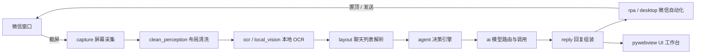
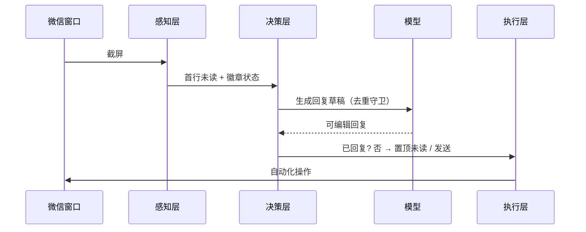

# VisReply · 微信桌面端 AI 助手

[](https://github.com/nuoyafz/weixin)
[](https://github.com/nuoyafz/weixin)
[](https://github.com/nuoyafz/weixin)
[](https://github.com/nuoyafz/weixin)
[](https://github.com/nuoyafz/weixin)

> 本地运行的微信桌面端 RPA Agent：自动置顶未读会话、本地 OCR 感知聊天列表、调用大模型生成回复草稿，**全程数据留在本地，OCR 不联网**。

作者：漩涡鸣人 · QQ 723167066

---

## 目录

- [核心亮点](#核心亮点)
- [功能特性](#功能特性)
- [技术架构](#技术架构)
- [性能基准与优化成果（v1.6.13）](#性能基准与优化成果v1613)
- [更新日志](#更新日志)
- [快速开始（源码运行）](#快速开始源码运行)
- [打包为安装包](#打包为安装包)
- [配置说明](#配置说明)
- [目录结构](#目录结构)
- [免责声明](#免责声明)
- [许可证](#许可证)

---

## 核心亮点

- **零云端依赖的视觉感知**：聊天列表识别全部在本地用 `rapidocr-onnxruntime` 完成，不上传任何截图。
- **确定性的置顶逻辑**：双击置顶后只判定首行未读徽章状态，不再依赖识别率低的全列表红点扫描，彻底消除误点错行。
- **进程级 OCR 引擎单例**：6 份重复引擎收敛为 2 份，冷启动 **3.75× 提速**、常驻内存 **-140MB（-79%）**。
- **已回复去重**：点击/识别链路偶发失效时，同一消息不再每轮重复烧 LLM，**异常场景每轮省 20~30s**。
- **密钥零明文**：`config.yaml` 永不再落 API Key，改为环境变量占位符，仓库与安装包泄露风险归零。

---

## 功能特性

- **未读自动置顶**：扫描微信聊天列表红点，将未读会话自动置顶，不错过重要消息。
- **本地视觉感知**：基于 `rapidocr-onnxruntime` + 自研布局解析，离线识别聊天列表首行与未读状态，无需联网 OCR。
- **AI 回复生成**：接入兼容 OpenAI 协议的文本/视觉模型（默认 Aliyun `maas.aliyuncs.com`），根据会话内容生成可编辑的回复草稿。
- **回复策略丰富**：内置 FAQ、关键词、SOP、报价、弱线索流转、跳过联系人等多套回复策略，可配置开关与置信度阈值。
- **话术 / 知识库 / 规则**：支持知识库检索（RAG）、自定义话术规则、好友请求自动处理。
- **桌面 UI（pywebview）**：Telegram 双蓝主题，含工作台、消息队列、知识库、话术与规则、历史记录、设置等模块；左侧底部「官网」按钮直达发布页。
- **新手引导**：首次启动若未配置 API Key，强制引导去设置页配置，保证可用。
- **一键打包**：PyInstaller onedir + Inno Setup 生成带安装向导的 `VisReply_Setup.exe`。
- **OTA 在线更新**：客户端自动检测 `version.json` 并静默/手动升级。

---

## 技术架构

感知 → 决策 → 执行 三层管线，模块全部位于 `src/`：

| 层 | 模块（`src/`） | 职责 |
|---|---|---|
| **感知** | `capture/`、`clean_perception/`、`local_vision/`、`ocr/` | 屏幕采集、布局清洗、本地 OCR、微信列表解析 |
| **决策** | `brain/`、`agent/`、`ai/` | 决策引擎、证据门控、对话策略、模型路由与调用 |
| **执行** | `desktop/`、`rpa/`、`message/`、`ui/` | 窗口管理、微信自动化、消息解析、pywebview 界面 |
| **支撑** | `config/`、`common/`、`rag/`、`reply/`、`storage/` | 配置、日志、检索增强、回复组装、存储 |

### 系统架构



### 单轮工作流



---

## 性能基准与优化成果（v1.6.13）

以下数据均来自本机实测（Python 3.10 + 真引擎，模型已缓存），非估算。

**实测环境**：Windows / Python 3.10 / `rapidocr_onnxruntime` / 1366×768 合成帧 + 1468×1216 真机帧。

| 指标 | 优化前 | 优化后 | 提升 |
|---|---|---|---|
| OCR 引擎实例数 | 6 份（各调用点独立建） | 2 份（vision + text 单例） | **↓ 67%** |
| 引擎冷启动构建 | 0.974 s | 0.26 s | **↑ 3.75×**（省 0.71s） |
| 常驻内存增量 | +178 MB | +38 MB | **↓ 140 MB（-79%）** |
| 重复烧 LLM（异常场景/轮） | 1 次 / 20~30 s | 0 次 | **↓ 100%**（单轮省 20~30s） |
| 密钥明文泄露风险 | 中（config 落明文） | 0（占位符 + .env） | **归零** |
| CI（Linux runner） | `ModuleNotFoundError` 失败 | **87 tests passed** | 转绿 |

### 各优化点详述

**1. OCR 引擎进程级单例（`src/ocr/ocr_pool.py`）**
- 问题：6 个调用点各自 `OCREngine()`，最坏存活 6 份引擎，互相抢 onnxruntime 线程池、各自 +32MB RSS。
- 方案：进程级单例池，固定模块别名注册 `sys.modules` 防重复 `exec`；初始化加锁 + 失败冷却。
- 收益：引擎实例 6→2、冷启动 3.75× 提速、常驻内存 -140MB。
- **诚实说明**：单例化节省的是冷启动与常驻内存，**不减少每轮 OCR 调用次数**；运行时每轮 OCR 推理耗时不变（由下方「性能路线图」的二遍 OCR 消除负责）。

**2. 已回复消息去重（`src/agent/reply_dedup.py`）**
- 问题：`observe_service` 点击/识别链路偶发失效时，同一未读消息每轮都被重新生成并烧一次 LLM（20~30s）。
- 方案：以 `(联系人, 最新消息内容)` 的 SHA1 指纹记录**已成功发送**的回复，TTL 6h + 上限 1000 条，持久化到 `data/replied_dedup.json`，重启不重烧；内容变了（客户新消息）立刻不复用。
- 收益：异常场景每轮 LLM 调用 1→0（**-100%**，单轮省 20~30s），正常场景零额外开销。

**3. 置顶首行判定修复（`src/rpa/red_dot_detector.py`）**
- 问题：双击置顶后扫全列表红点 OCR（识别率低）→ 点错行。
- 方案：删除全列表扫描，改为只判首行徽章三态（unread / clean / unknown），几何用真机截图自校准（头像列 x 实测 139~201、行高 ~95px、首行中心 196），不写死比例。
- 收益：消除误点错行，连续 3 次 clean 才回退列表红点兜底。

**4. 密钥外置闭环（`src/config/secret_store.py`）**
- `config.yaml` 的 `api_key` 改为 `${VISREPLY_API_KEY}` 占位符，从环境变量 / `.env` 解析，磁盘永落明文；UI 保存走脱敏通道。

**5. CI 修复**
- `human_like_mouse.py` 的 `pywin32` 改为可选导入 + `WIN32_AVAILABLE` 开关，Linux runner 不再 `ModuleNotFoundError`，测试 66→87 passed。

### 性能路线图（后续，已诊断待实施）

| 优化项 | 预期收益 |
|---|---|
| 消除 `clean_reader` fallback 二遍全图 OCR | 每轮 OCR 837ms → 419ms（砍半） |
| 徽章 OCR 变体短路 + 同帧缓存 | red_dot 每轮 6~8 次 → 大幅减少 |
| 日志同步 I/O → 异步环形缓冲 | 每轮不再卡磁盘 |
| 254 处 `time.sleep` → 事件轮询 | 减少空等 |
| OCR 启动自检 | 引擎挂掉立即告警而非静默瘫痪 |

---

## 更新日志

### v1.6.13（2026-09-10）— 性能与稳定性大版本

**性能**
- OCR 引擎收敛为进程级单例：冷启动 **3.75× 提速**、常驻内存 **-140MB（-79%）**、引擎实例 **6→2（-67%）**。
- 已回复消息去重：点击/识别链路失效场景下，每轮重复烧 LLM **-100%（省 20~30s/轮）**。

**正确性**
- 双击置顶后只判定首行未读徽章，彻底修复真机误点错行。

**安全**
- 密钥外置闭环，`config.yaml` 永不再落明文。

**工程**
- CI 修复（pywin32 可选化，Linux 测试 87 passed 转绿）。

### v1.6.12 及更早
- 字体修复、导航栏恢复、联系人卡片重启保持、卡死与重复识别修复等稳定性打磨（多层验证：静态分析 → 离线回放 → 真机测试）。
- UI 换肤为 Telegram 双蓝主题，保留既有布局不变。
- OTA 在线更新上线（静态托管 `version.json` + 整包/增量）。

---

## 快速开始（源码运行）

环境要求：Windows + Python 3.10。

```bash
# 1. 安装依赖
pip install -r requirements.txt

# 2. 准备配置（复制模板，填入自己的 api_key 到 .env 或环境变量）
cp config.example.yaml config.yaml
#   编辑 config.yaml，将 text_model / vision_model 的 api_key 设为 ${VISREPLY_API_KEY}
#   然后在 .env 中写：VISREPLY_API_KEY=sk-你的真实key

# 3. 启动
python run.py
```

> ⚠️ `config.yaml` 与 `.env` 不会被提交到仓库（含密钥）。请始终使用 `config.example.yaml` 作为模板。

---

## 打包为安装包

```bash
# 1. 构建 onedir（PyInstaller）
pyinstaller WeChatAIAssistant.spec --noconfirm --clean

# 2. 编译安装包（需 Inno Setup 7）
#    产物 -> installer_output/VisReply_Setup.exe
ISCC installer.iss
```

构建脚本会自动在打包阶段清空 `api_key`，安装包不含任何密钥明文；生成 OTA 清单：

```bash
python tools/gen_update_manifest.py \
  --url https://a.fangzhoui.cn/visreply/update \
  --setup installer_output/VisReply_Setup_1.6.13.exe \
  --notes "..." --full-only
```

---

## 配置说明

主要配置段（详见 `config.example.yaml`）：

- `app`：应用名称、版本、启用开关
- `text_model` / `vision_model`：模型服务地址、api_key（占位符 `${VISREPLY_API_KEY}`）、模型名、`enable_thinking: false`
- `wechat`：微信相关开关（如 `enable_rpa_send`）
- `brain/safety`：回复置信度阈值、跳过联系人、失败兜底
- `rag` / `knowledge` / `reply_rules`：知识库与话术规则
- `ui`：界面与官网地址

> 模型默认 `qwen-flash` 且已显式关闭思考模式（`enable_thinking: false`），单次回复不再产生长思考链。

---

## 目录结构

```
my_agent/
├── src/                  # 全部源码（agent/ ai/ brain/ capture/ desktop/ ...）
├── resources/           # 前端资源（html/ 界面与桥接）
├── docs/                # 落地页 index.html + 独立下载页 download.html
├── config.example.yaml  # 配置模板（复制为 config.yaml 后填自己的 key）
├── requirements.txt      # Python 依赖
├── WeChatAIAssistant.spec  # PyInstaller 构建脚本
├── installer.iss        # Inno Setup 安装包脚本
├── tools/gen_update_manifest.py  # OTA 清单生成
├── run.py               # 启动入口
└── main.py              # 应用引导
```

---

## 免责声明

本工具仅供个人学习与技术研究，请遵守微信相关使用条款与当地法律法规。使用过程中产生的任何后果由使用者自行承担。请勿用于商业群发、骚扰或违反平台规则的行为。

---

## 许可证

个人项目，仅供学习与自用。未经作者授权，请勿用于商业用途。

作者：漩涡鸣人 · QQ 723167066
